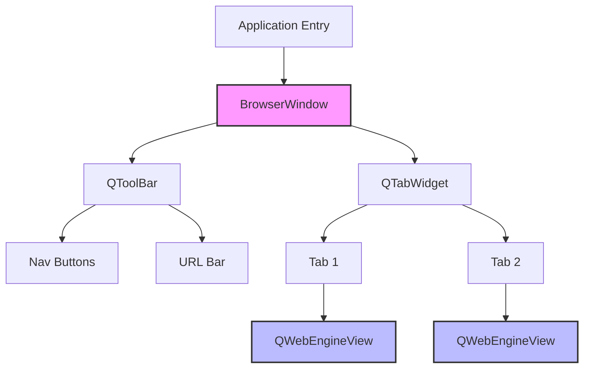
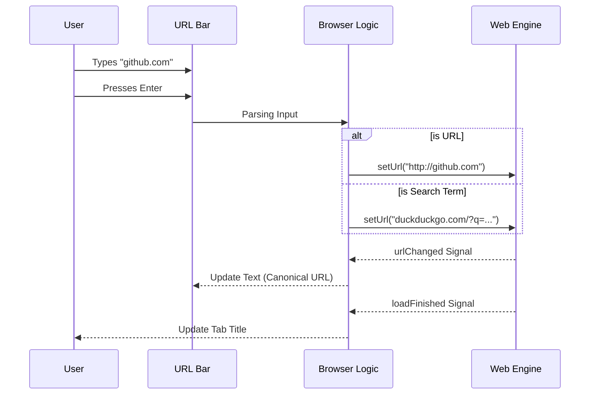
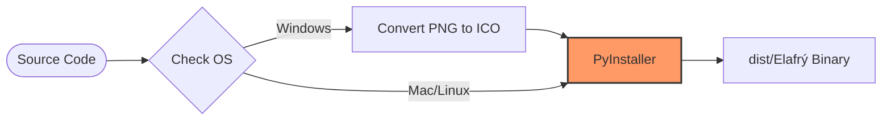

# Elafrý Architecture

This document provides a high-level overview of the internal architecture of **Elafrý**, a lightweight web browser built with Python and PyQt6.

## Technology Stack

- **Language**: Python 3.9+
- **GUI Framework**: [PyQt6](https://pypi.org/project/PyQt6/) (Python bindings for Qt)
- **Web Engine**: [QtWebEngine](https://doc.qt.io/qt-6/qtwebengine-index.html) (Chromium-based rendering engine)
- **Build System**: PyInstaller

## Project Structure

```text
elafry/
├── browser.py           # Main application entry point and logic
├── build_binaries.py    # Cross-platform build script for PyInstaller
├── logo.png             # Application Icon
├── requirements.txt     # Python dependencies
├── .github/             # GitHub Actions for CI/CD
└── dist/                # Output folder for compiled binaries
```

## Core Components

The application is currently designed as a monolithic script (`browser.py`) for simplicity, containing a single main class: `BrowserWindow`.

### 1. BrowserWindow (QMainWindow)
Inherits from `QMainWindow`, this class manages the entire application lifecycle.
- **Responsibility**: Window management, Layouts, Toolbar initialization, and Event handling.
- **Key Methods**:
  - `__init__`: Sets up the UI, themes, and connects signals.
  - `add_new_tab`: Creates a new `QWebEngineView` instance and adds it to the tab container.
  - `navigate_to_url`: Handles URL input logic (validation, search engine query vs direct URL).

### 2. Tab System (QTabWidget)
We use a standard `QTabWidget` to manage multiple browsing contexts.
- **Document Mode**: Enabled to give a cleaner, modern look (tabs flow into the title bar area conceptually).
- **Tab Content**: Each tab contains a `QWebEngineView`.

### 3. Web Rendering (QWebEngineView)
Each tab is an instance of `QWebEngineView`, which is a full Chromium-based browser widget.
- **Signals**: We listen to `urlChanged`, `loadFinished` and `titleChanged` to update the UI (URL bar text, window title, tab label).

#### Component Hierarchy



### 4. Theming Engine
Elafrý uses Qt Stylesheets (QSS) for theming, which is similar to CSS.
- **Themes**: Currently supports `Light` and `Dark` modes.
- **Implementation**: The `apply_theme()` method dynamically injects a large CSS string into `self.setStyleSheet()` based on the `self.current_theme` state.

## Data Flow



1. **User Input**: User types in `self.url_bar` (QLineEdit).
2. **Parsing**: `navigate_to_url()` checks if input is a valid URL or a search query.
3. **Navigation**: `tabs.currentWidget().setUrl(url)` triggers the engine.
4. **Feedback**: 
   - Engine starts loading -> signals triggered.
   - UI updates (Tab title updates, URL bar updates to canonical URL).

## Build Pipeline

The project uses a custom Python script (`build_binaries.py`) to wrap `PyInstaller`.



- **Icon Handling**: Automatically converts `logo.png` to `logo.ico` on Windows using Pillow for correct taskbar icon display.
- **Cross-Platform**: The script detects `sys.platform` to adjust path separators (`:` vs `;`) and arguments for MacOS `.app` bundles vs Windows `.exe`.
